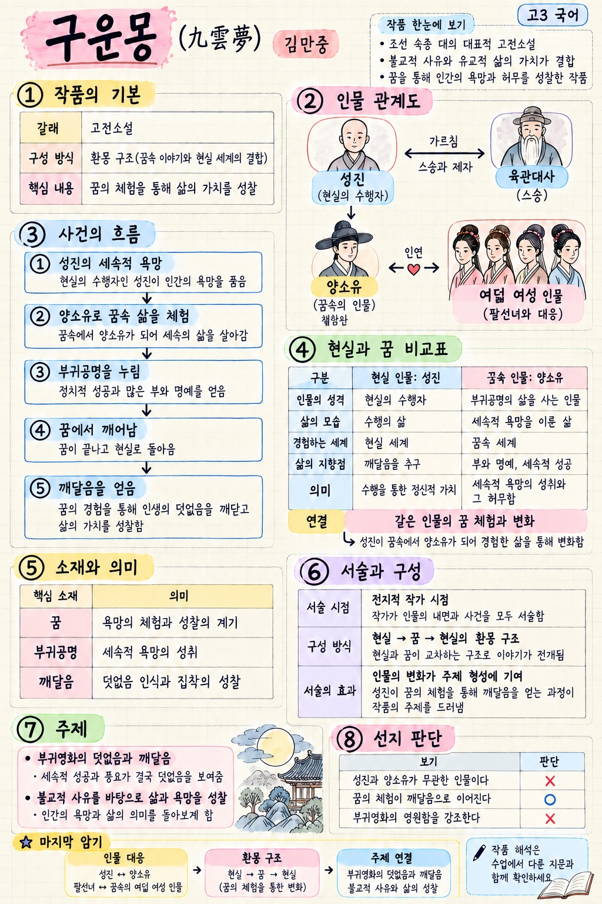
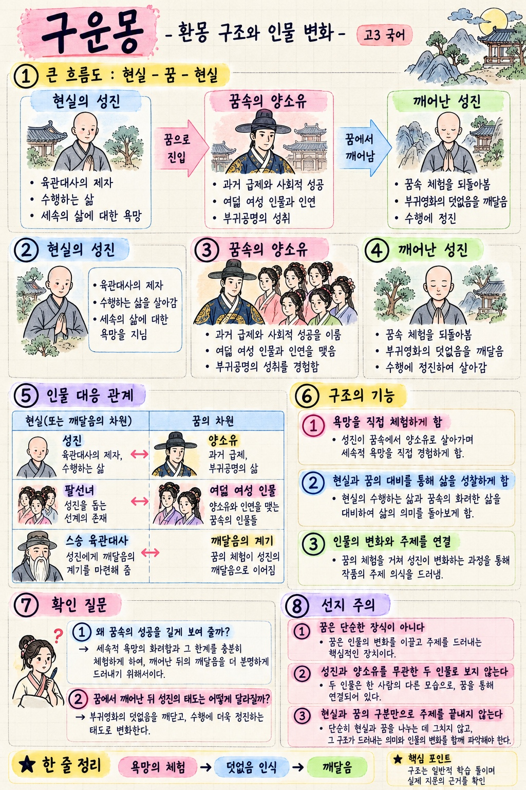
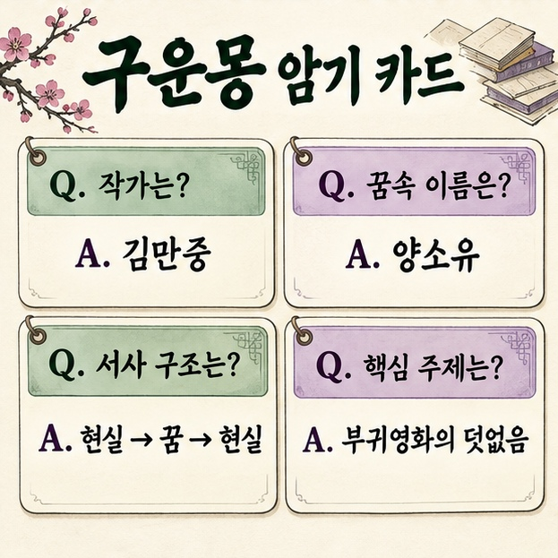
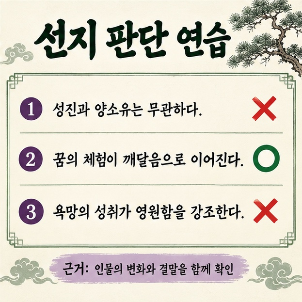
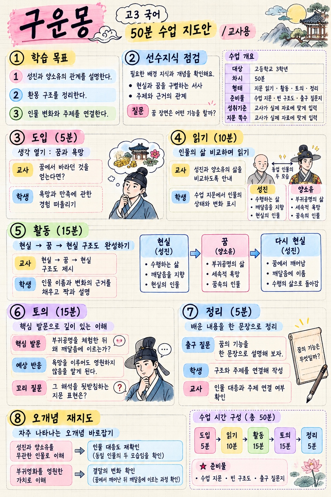
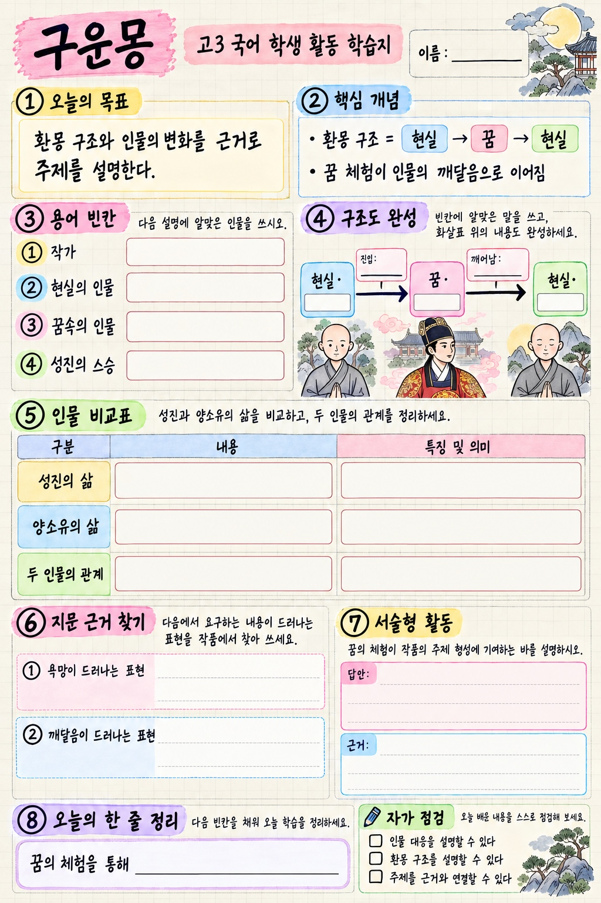
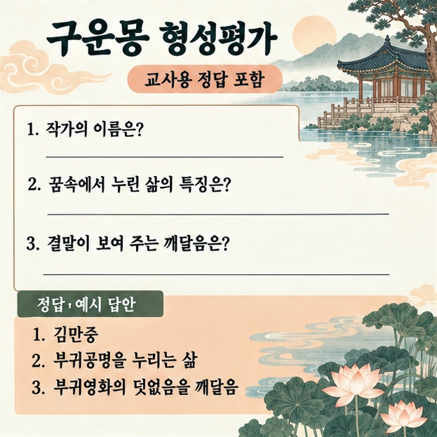
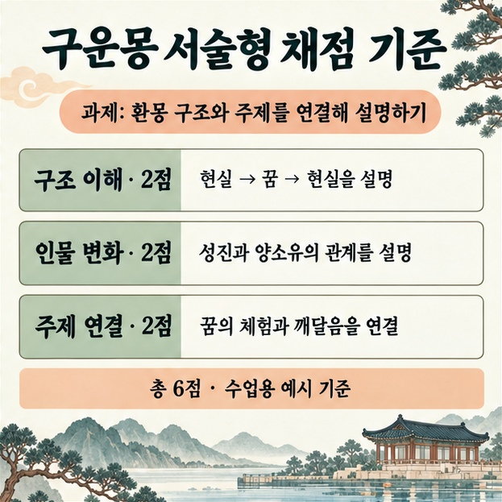

# 고3 구운몽 실제 생성 이미지

학생용 4종과 교사용 4종입니다. 상세 노트·구조도·지도안·학습지 4종에는 실제 생성에 사용한 지시를 제공합니다. 기본 카드·선지·형성평가·채점 기준 4종에는 독립 이미지로 요청하는 재현용 프롬프트를 제공합니다. 이미지에는 스타일 참고 자료가 함께 사용되었습니다. 동일한 결과를 보장하지 않습니다.

문학 개념 참고: https://encykorea.aks.ac.kr/Article/E0005948

## 구운몽 고3 시험 대비 학습 노트



```text
고3 국어 「구운몽」의 구운몽 고3 시험 대비 학습 노트 이미지를 만들어 주세요.

첨부한 참고 이미지는 시각 스타일의 기준으로만 사용하세요. 참고 이미지의 문구와 사실을 그대로 복사하지 마세요. 한 장 전체가 하나의 완성된 고3 국어 학습 자료여야 합니다. 여러 개의 독립 이미지를 합친 모음이나 썸네일을 만들지 마세요. 세로형 고해상도, 종이의 옅은 모눈과 크림색 질감, 검은 펜 손글씨, 분홍·노랑·파랑·초록·보라 형광펜 제목, 얇은 테두리, 작은 고전 인물 일러스트와 관계 화살표를 사용하세요. 내용이 주인공이며 장식은 작은 영역에만 넣으세요. 참고 이미지처럼 페이지 전체에 정보가 충분한 학습 노트를 만들어 주세요. 제목과 6~8개 번호 섹션, 개념 표·관계도·사건 흐름·시험 포인트를 조화롭게 배치하세요. 한글이 선명하고 읽기 쉽도록 문장을 짧게 쓰되 내용 항목을 생략하지 마세요. 문자가 잘리거나 겹치지 않도록 여백을 확보하세요. 아래 제공한 학습 내용만 사용하고 사실·인물 이름·정답·배점을 바꾸지 마세요. 원문 인용이나 교과서 쪽수를 만들어 내지 마세요.

반드시 포함할 학습 내용과 배치 순서:
구운몽 · 김만중 / 고3 국어
① 작품의 기본: 고전소설 · 환몽 구조 / 꿈의 체험을 통해 삶의 가치를 성찰
② 인물 관계도: 성진(현실의 수행자) ↔ 육관대사(스승) / 성진 → 꿈속의 양소유 / 팔선녀 ↔ 꿈속의 여덟 여성 인물
③ 사건의 흐름: 성진의 세속적 욕망 → 양소유로 꿈속 삶을 체험 → 부귀공명을 누림 → 꿈에서 깨어남 → 깨달음을 얻음
④ 현실과 꿈 비교표: 현실 인물 성진, 수행의 삶 / 꿈속 인물 양소유, 부귀공명의 삶 / 연결: 같은 인물의 꿈 체험과 변화
⑤ 소재와 의미: 꿈 = 욕망의 체험과 성찰의 계기 / 부귀공명 = 세속적 욕망의 성취 / 깨달음 = 덧없음 인식과 집착의 성찰
⑥ 서술과 구성: 전지적 작가 시점 / 현실 → 꿈 → 현실의 환몽 구조 / 인물의 변화가 주제 형성에 기여
⑦ 주제: 부귀영화의 덧없음과 깨달음 / 불교적 사유를 바탕으로 삶과 욕망을 성찰
⑧ 선지 판단: 성진과 양소유가 무관한 인물이다 × / 꿈의 체험이 깨달음으로 이어진다 ○ / 부귀영화의 영원함을 강조한다 ×
마지막 암기: 인물 대응 · 환몽 구조 · 주제 연결
작품 해석은 수업에서 다룬 지문과 함께 확인

표와 흐름도의 연결을 정확히 표시하고 한글을 마지막으로 점검해 주세요. 실제 사용할 수 있는 상세 학습 자료 이미지 한 장으로 완성해 주세요.
```

## 구운몽 환몽 구조와 인물 변화



```text
고3 국어 「구운몽」의 구운몽 환몽 구조와 인물 변화 이미지를 만들어 주세요.

첨부한 참고 이미지는 시각 스타일의 기준으로만 사용하세요. 참고 이미지의 문구와 사실을 그대로 복사하지 마세요. 한 장 전체가 하나의 완성된 고3 국어 학습 자료여야 합니다. 여러 개의 독립 이미지를 합친 모음이나 썸네일을 만들지 마세요. 세로형 고해상도, 종이의 옅은 모눈과 크림색 질감, 검은 펜 손글씨, 분홍·노랑·파랑·초록·보라 형광펜 제목, 얇은 테두리, 작은 고전 인물 일러스트와 관계 화살표를 사용하세요. 내용이 주인공이며 장식은 작은 영역에만 넣으세요. 참고 이미지처럼 페이지 전체에 정보가 충분한 학습 노트를 만들어 주세요. 제목과 6~8개 번호 섹션, 개념 표·관계도·사건 흐름·시험 포인트를 조화롭게 배치하세요. 한글이 선명하고 읽기 쉽도록 문장을 짧게 쓰되 내용 항목을 생략하지 마세요. 문자가 잘리거나 겹치지 않도록 여백을 확보하세요. 아래 제공한 학습 내용만 사용하고 사실·인물 이름·정답·배점을 바꾸지 마세요. 원문 인용이나 교과서 쪽수를 만들어 내지 마세요.

반드시 포함할 학습 내용과 배치 순서:
구운몽 · 환몽 구조와 인물 변화 / 고3 국어
① 큰 흐름도: 현실·성진 → 꿈·양소유 → 현실·성진 / 화살표: 꿈으로 진입 / 꿈에서 깨어남
② 현실의 성진: 육관대사의 제자 / 수행하는 삶 / 세속의 삶에 대한 욕망
③ 꿈속의 양소유: 과거 급제와 사회적 성공 / 여덟 여성 인물과 인연 / 부귀공명의 성취
④ 깨어난 성진: 꿈속 체험을 되돌아봄 / 부귀영화의 덧없음을 깨달음 / 수행에 정진
⑤ 인물 대응: 성진 ↔ 양소유 / 팔선녀 ↔ 여덟 여성 인물 / 스승 육관대사 ↔ 깨달음의 계기
⑥ 구조의 기능: 욕망을 직접 체험하게 함 / 현실과 꿈의 대비를 통해 삶을 성찰하게 함 / 인물의 변화와 주제를 연결
⑦ 확인 질문: 왜 꿈속의 성공을 길게 보여 줄까? / 꿈에서 깨어난 뒤 성진의 태도는 어떻게 달라질까?
⑧ 선지 주의: 꿈은 단순한 장식이 아니다 / 성진과 양소유를 무관한 두 인물로 보지 않는다 / 현실과 꿈의 구분만으로 주제를 끝내지 않는다
한 줄 정리: 욕망의 체험 → 덧없음 인식 → 깨달음
구조는 일반적 학습 틀이며 실제 지문의 근거를 확인

표와 흐름도의 연결을 정확히 표시하고 한글을 마지막으로 점검해 주세요. 실제 사용할 수 있는 상세 학습 자료 이미지 한 장으로 완성해 주세요.
```

## 구운몽 암기 카드



```text
고3 국어 「구운몽」 학습용 구운몽 암기 카드 이미지를 만들어 주세요. 실제 한글 내용을 읽을 수 있는 완성된 학습 자료로 구성해 주세요. 제목: 구운몽 암기 카드. 포함할 내용은 아래와 같습니다.

Q. 작가는? / A. 김만중
Q. 꿈속 이름은? / A. 양소유
Q. 서사 구조는? / A. 현실 → 꿈 → 현실
Q. 핵심 주제는? / A. 부귀영화의 덧없음

크림색 바탕, 진한 초록색 글씨, 보라·살구색 포인트, 큰 한글 글꼴, 넉넉한 여백을 사용하세요. 맞춤법을 정확하게 쓰고 주어진 내용 외의 사실은 추가하지 마세요. 내용이 잘리지 않게 독립된 한 장 이미지로 완성하세요.
```

## 선지 판단 연습



```text
고3 국어 「구운몽」 학습용 선지 판단 연습 이미지를 만들어 주세요. 실제 한글 내용을 읽을 수 있는 완성된 학습 자료로 구성해 주세요. 제목: 선지 판단 연습. 포함할 내용은 아래와 같습니다.

① 성진과 양소유는 무관하다. ×
② 꿈의 체험이 깨달음으로 이어진다. ○
③ 욕망의 성취가 영원함을 강조한다. ×
근거: 인물의 변화와 결말을 함께 확인

크림색 바탕, 진한 초록색 글씨, 보라·살구색 포인트, 큰 한글 글꼴, 넉넉한 여백을 사용하세요. 맞춤법을 정확하게 쓰고 주어진 내용 외의 사실은 추가하지 마세요. 내용이 잘리지 않게 독립된 한 장 이미지로 완성하세요.
```

## 구운몽 고3 50분 수업 지도안



```text
고3 국어 「구운몽」의 구운몽 고3 50분 수업 지도안 이미지를 만들어 주세요.

첨부한 참고 이미지는 시각 스타일의 기준으로만 사용하세요. 참고 이미지의 문구와 사실을 그대로 복사하지 마세요. 한 장 전체가 하나의 완성된 고3 국어 학습 자료여야 합니다. 여러 개의 독립 이미지를 합친 모음이나 썸네일을 만들지 마세요. 세로형 고해상도, 종이의 옅은 모눈과 크림색 질감, 검은 펜 손글씨, 분홍·노랑·파랑·초록·보라 형광펜 제목, 얇은 테두리, 작은 고전 인물 일러스트와 관계 화살표를 사용하세요. 내용이 주인공이며 장식은 작은 영역에만 넣으세요. 참고 이미지처럼 페이지 전체에 정보가 충분한 학습 노트를 만들어 주세요. 제목과 6~8개 번호 섹션, 개념 표·관계도·사건 흐름·시험 포인트를 조화롭게 배치하세요. 한글이 선명하고 읽기 쉽도록 문장을 짧게 쓰되 내용 항목을 생략하지 마세요. 문자가 잘리거나 겹치지 않도록 여백을 확보하세요. 아래 제공한 학습 내용만 사용하고 사실·인물 이름·정답·배점을 바꾸지 마세요. 원문 인용이나 교과서 쪽수를 만들어 내지 마세요.

반드시 포함할 학습 내용과 배치 순서:
구운몽 · 고3 국어 50분 수업 지도안 / 교사용
① 학습 목표: 성진과 양소유의 관계를 설명한다 / 환몽 구조를 정리한다 / 인물 변화와 주제를 연결한다
② 선수지식 점검: 현실과 꿈을 구별하는 서사 / 주제와 근거의 관계 / 질문: 꿈 장면은 어떤 기능을 할까?
③ 도입 5분: 교사: 꿈에서 바라던 것을 얻는다면? / 학생: 욕망과 만족에 관한 경험 떠올리기
④ 읽기 10분: 교사: 성진과 양소유의 삶을 비교하도록 안내 / 학생: 수업 지문에서 인물의 상태와 변화 표시
⑤ 활동 15분: 교사: 현실 → 꿈 → 현실 구조도 제시 / 학생: 인물 이름과 변화의 근거를 채우고 짝과 설명
⑥ 토의 15분: 핵심 발문: 부귀공명을 체험한 뒤 왜 깨달음에 이르는가? / 예상 반응: 욕망을 이루어도 영원하지 않음을 알게 된다 / 꼬리 질문: 그 해석을 뒷받침하는 지문 표현은?
⑦ 정리 5분: 출구 질문: 꿈의 기능을 한 문장으로 설명 / 학생: 구조와 주제를 연결해 작성 / 교사: 인물 대응과 주제 연결 여부 확인
⑧ 오개념 재지도: 성진과 양소유를 무관한 인물로 이해 → 인물 대응도 재확인 / 부귀영화를 영원한 가치로 이해 → 결말의 변화 확인
시간 합계: 5 + 10 + 15 + 15 + 5 = 50분
준비물: 수업 지문 · 빈 구조도 · 출구 질문지
성취기준 번호와 지문 쪽수는 교사가 실제 자료에 맞게 입력

표와 흐름도의 연결을 정확히 표시하고 한글을 마지막으로 점검해 주세요. 실제 사용할 수 있는 상세 학습 자료 이미지 한 장으로 완성해 주세요.
```

## 구운몽 고3 학생 활동 학습지



```text
고3 국어 「구운몽」의 구운몽 고3 학생 활동 학습지 이미지를 만들어 주세요.

첨부한 참고 이미지는 시각 스타일의 기준으로만 사용하세요. 참고 이미지의 문구와 사실을 그대로 복사하지 마세요. 한 장 전체가 하나의 완성된 고3 국어 학습 자료여야 합니다. 여러 개의 독립 이미지를 합친 모음이나 썸네일을 만들지 마세요. 세로형 고해상도, 종이의 옅은 모눈과 크림색 질감, 검은 펜 손글씨, 분홍·노랑·파랑·초록·보라 형광펜 제목, 얇은 테두리, 작은 고전 인물 일러스트와 관계 화살표를 사용하세요. 내용이 주인공이며 장식은 작은 영역에만 넣으세요. 참고 이미지처럼 페이지 전체에 정보가 충분한 학습 노트를 만들어 주세요. 제목과 6~8개 번호 섹션, 개념 표·관계도·사건 흐름·시험 포인트를 조화롭게 배치하세요. 한글이 선명하고 읽기 쉽도록 문장을 짧게 쓰되 내용 항목을 생략하지 마세요. 문자가 잘리거나 겹치지 않도록 여백을 확보하세요. 아래 제공한 학습 내용만 사용하고 사실·인물 이름·정답·배점을 바꾸지 마세요. 원문 인용이나 교과서 쪽수를 만들어 내지 마세요.

반드시 포함할 학습 내용과 배치 순서:
구운몽 · 고3 국어 학생 활동 학습지 / 이름: ______
① 오늘의 목표: 환몽 구조와 인물의 변화를 근거로 주제를 설명한다
② 핵심 개념: 환몽 구조 = 현실 → 꿈 → 현실 / 꿈 체험이 인물의 깨달음으로 이어짐
③ 용어 빈칸: 작가 [      ] / 현실의 인물 [      ] / 꿈속의 인물 [      ] / 성진의 스승 [      ]
④ 구조도 완성: 현실·[      ] → 꿈·[      ] → 현실·[      ] / 화살표 위에 진입과 깨어남을 표시
⑤ 인물 비교표: 성진의 삶 [                 ] / 양소유의 삶 [                 ] / 두 인물의 관계 [                 ]
⑥ 지문 근거 찾기: 욕망이 드러나는 표현 [                       ] / 깨달음이 드러나는 표현 [                       ]
⑦ 서술형 활동: 꿈의 체험이 작품의 주제 형성에 기여하는 바를 설명하시오. / 답안: __________________________________ / 근거: __________________________________
⑧ 오늘의 한 줄 정리: 꿈의 체험을 통해 [                         ]
자가 점검: □ 인물 대응을 설명할 수 있다 □ 환몽 구조를 설명할 수 있다 □ 주제를 근거와 연결할 수 있다
학생용 페이지에는 정답을 넣지 않기 / 교사용 정답·해설은 별도 자료로 제공

표와 흐름도의 연결을 정확히 표시하고 한글을 마지막으로 점검해 주세요. 실제 사용할 수 있는 상세 학습 자료 이미지 한 장으로 완성해 주세요.
```

## 구운몽 형성평가



```text
고3 국어 「구운몽」 학습용 구운몽 형성평가 이미지를 만들어 주세요. 실제 한글 내용을 읽을 수 있는 완성된 학습 자료로 구성해 주세요. 제목: 구운몽 형성평가. 포함할 내용은 아래와 같습니다.

1. 작가의 이름은?
2. 꿈속에서 누린 삶의 특징은?
3. 결말이 보여 주는 깨달음은?

정답·예시 답안
1. 김만중
2. 부귀공명을 누리는 삶
3. 부귀영화의 덧없음을 깨달음

크림색 바탕, 진한 초록색 글씨, 보라·살구색 포인트, 큰 한글 글꼴, 넉넉한 여백을 사용하세요. 맞춤법을 정확하게 쓰고 주어진 내용 외의 사실은 추가하지 마세요. 내용이 잘리지 않게 독립된 한 장 이미지로 완성하세요.
```

## 구운몽 서술형 채점 기준



```text
고3 국어 「구운몽」 학습용 구운몽 서술형 채점 기준 이미지를 만들어 주세요. 실제 한글 내용을 읽을 수 있는 완성된 학습 자료로 구성해 주세요. 제목: 구운몽 서술형 채점 기준. 포함할 내용은 아래와 같습니다.

과제: 환몽 구조와 주제를 연결해 설명하기
구조 이해 · 2점: 현실 → 꿈 → 현실을 설명
인물 변화 · 2점: 성진과 양소유의 관계를 설명
주제 연결 · 2점: 꿈의 체험과 깨달음을 연결
총 6점 · 수업용 예시 기준

크림색 바탕, 진한 초록색 글씨, 보라·살구색 포인트, 큰 한글 글꼴, 넉넉한 여백을 사용하세요. 맞춤법을 정확하게 쓰고 주어진 내용 외의 사실은 추가하지 마세요. 내용이 잘리지 않게 독립된 한 장 이미지로 완성하세요.
```

## 상세 노트의 검수 후 표기 수정 지시

생성한 노트를 첨부하고 아래 지시로 인물 대응 표기를 수정했습니다.

```text
첨부된 구운몽 상세 학습 노트 이미지의 인물 관계도에서 오른쪽 여성 인물 그림 아래 분홍색 이름표만 정확하게 수정해 주세요. 현재 '팔선녀'와 '(꿈속의 여덟 여성 인물)'이라고 되어 있는데, 이름표를 '여덟 여성 인물'로 바꾸고 그 아래 설명을 '(팔선녀와 대응)'으로 바꾸세요. 팔선녀는 현실 층위의 존재이고 여덟 여성 인물은 꿈속 인물이라는 구분이 정확히 드러나야 합니다. 나머지 제목, 그림, 글씨, 표, 내용, 배치, 해상도는 그대로 유지하세요. 특히 맨 아래 암기 영역의 '팔선녀 ↔ 꿈속의 여성 인물'은 그대로 유지하세요.
```
